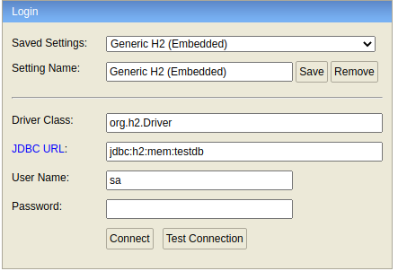
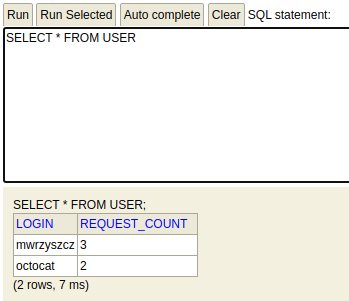

## Weather checker service - 5 day forecast

---

### How to use

1. Clone repository `$ https://github.com/mwrzyszcz/git-statisctics.git`
2. Run application
    * OpenJDK 11
    * Maven 3+
    
By default server starting on `8080
`
4. Send `GET` request

#### Example
`GET http://localhost:8080/api/users/{username}`  - find git user

4. Consume response

#### Examples
`GET http://localhost:8080/api/users/octocat`
```json
{
  "id": 583231,
  "login": "octocat",
  "name": "The Octocat",
  "type": "User",
  "avatarUrl": "https://avatars.githubusercontent.com/u/583231?v=4",
  "createdAt": "2011-01-25T18:44:36",
  "calculations": "0.015720"
}
```
`GET http://localhost:8080/api/users/mwrzyszcz`
```json
{
  "id": 24394563,
  "login": "mwrzyszcz",
  "name": null,
  "type": "User",
  "avatarUrl": "https://avatars.githubusercontent.com/u/24394563?v=4",
  "createdAt": "2016-12-05T18:01:39",
  "calculations": "16.00000"
}
```

5. Verify values in H2 database

Go to `http://localhost:8080/h2`

and use credentials like below


then click `Connect`

You will see



---
## Notes
###### Using [GitHub API](https://docs.github.com/en/rest)
